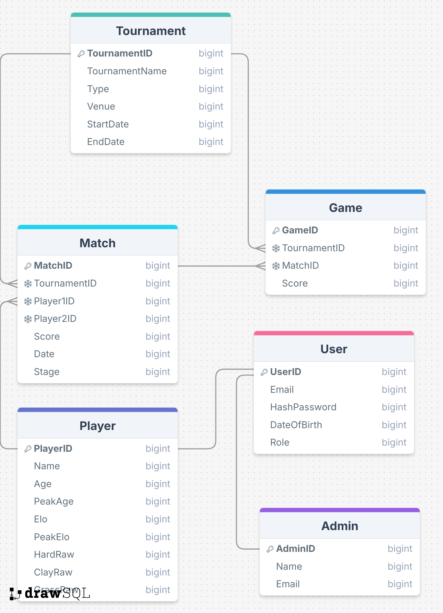

# Project Showdown

## Table of Contents
1. [Introduction](#introduction)
2. [DB Schema](#db-schema)
3. [Technologies Used](#technologies-used)
4. [Setup and Installation](#setup-and-installation)
5. [License](#license)

## Introduction
Welcome to G2T5's Tennis Tournament Management System - Project Showdown! Project Showdown is a full-stack application that utilises Springboot for backend and Vue.JS for frontend, seamlessly integrated through Docker for streamlined development and deployment.

Members:
1. Yap Seng How Coben (Product Owner, Developer)
2. Aaron Poh Ji Teck (Developer)
3. Leo Cong Liam Andre (Scrum Master, Developer)
4. Peh Siew Yu (Developer)
5. Pauliine Chew Gan Enn (Developer)
6. Arthur Chan Yeat Fuen (Developer)

## Workload Distribution
1. **Coben:**
* Worked on various backend logics including player, match and tournament services
2. **Aaron:**
* Configured authentication and security for the webapp, and helped deploy the app
3. **Andre:**
* Built frontend pages (e.g. landing page) and worked on the chatbot
4. **Siew Yu:**
* Worked on backend logic for email notifications and integration with frontend for notifications
5. **Pauline:**
* Designed and built the frontend of the webapp, including integration with the backend
6. **Arthur:**
* Worked on matchmaking logic and testing, and its implementation in backend

## DB Schema

[View Database Diagram](https://drawsql.app/teams/showdown/diagrams/showdown)

## Technologies Used
- Backend:
  - Java 17
  - Spring Boot 3.x
  - Spring Data JPA
  - Spring Security
- Frontend:
  - Vue.js
  - CSS
  - Bootstrap
- Database:
  - Firebase Firestore
- DevOps:
  - Docker version 27.2.0, build 3ab4256
  - Docker Compose

## Setup and Installation

### Prerequisites
- Java 17
- Node.js and npm
- Docker version 27.2.0 or higher
- Docker Compose
- Maven

### Clone the Repository
```bash
git clone <repository-url>
cd project-showdown
```

### Docker Setup
1. Make sure Docker is running on your machine
2. Build and run the containers:

```bash
docker-compose up --build
```

### Manual Setup

#### Backend Setup
1. In the root directory, install dependencies and run:
```bash
mvn clean install
mvn spring-boot:run
```

The backend server will start on `http://localhost:8080`

#### Frontend Setup
1. Navigate to frontend directory:
```bash
cd frontend
```

2. Install dependencies:
```bash
npm install
```

3. Start the development server:
```bash
npm run serve
```

The frontend application will be available on `http://localhost:8081`

### Environment Variables
Create a `.env` file in the root directory with the following variables:
```env
OAUTH_GOOGLE_ID=your_google_oauth_id
OAUTH_GOOGLE_SECRET=your_google_oauth_secret
OAUTH_FACEBOOK_ID=your_facebook_oauth_id
OAUTH_FACEBOOK_SECRET=your_facebook_oauth_secret
GOOGLE_CREDENTIALS_JSON=your_google_credentials_json
JWT_SECRET=your_jwt_secret
SUPPORT_EMAIL=your_support_email
APP_PASSWORD=your_app_password
```

### Accessing the Application
- Frontend: `http://localhost:8081`
- Backend API: `http://localhost:8080`


## License
This project is licensed under the [MIT License](LICENSE).